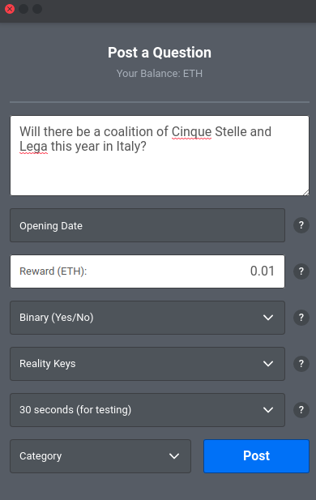

Reality Check Audit
===================

Exported by Edmund Edgar from document at 
https://docs.google.com/document/d/1__9q9k3iJ7XoRIvW9MHtHfN59Hv4CcDrUCH4qgAGxQk

Methodology
-----------

Structured reading is the main method of assessment. The code has been read twice, (1) line by line from start to end focusing on local errors, gas consumption and efficiency. (2) the second time was during a one day workshop together with the ideator and implementer Edmund Edgar and Smart Contract Auditor Alex Kampa. The aim of this workshop was to uncover more sophisticated vulnerabilities due to timing, network constraints and economic imbalances.

The following definitions of alert levels are adopted to label vulnerabilities.

CRITICAL
has potential to harm user or owner

MEDIUM
has potential to impede proper functioning of the smart contract

MINOR
there is a better way to do this or is just a matter of diverging tastes

General observations
--------------------

The coding style is clear and idiomatic. The design of the program is efficient as it is (1) storing only consensus relevant data and (2) minimizing *gas * needs in recurrently used code parts.

The author has paid attention to incorporate most of the good practices that the solidity developer community has found in the past. Low level errors are not present as the first pass shows (3 days of code reading)

Scope of the Audit
------------------

RealityCheck is a smart contract system that discovers truth by active disputes with *skin in the game*. A question is asked and a bounty is submitted for a correct answer. Concurrent answers put their own stake at risk. A dedicated arbiter can finally resolve disputes, if required.

Scope of the audit is a corpus of ~700 lines of Solidity:

`https://github.com/realitykeys/realitycheck/blob/master/truffle/contracts/Arbitrator.sol <https://github.com/realitykeys/realitycheck/blob/master/truffle/contracts/Arbitrator.sol>`_

`https://github.com/realitykeys/realitycheck/blob/207278cecb4a99709dd7e6c1b601196ba11e676e/truffle/contracts/RealityCheck.sol <https://github.com/realitykeys/realitycheck/blob/207278cecb4a99709dd7e6c1b601196ba11e676e/truffle/contracts/RealityCheck.sol>`_

Deployment, UI and other external modules are not part of the audit and can introduce vulnerabilities.

Audit
-----

First Pass
~~~~~~~~~~

L413 MINOR bondMustBeZero is always true
^^^^^^^^^^^^^^^^^^^^^^^^^^^^^^^^^^^^^^^^

Because function is not payable, modifier has no functionality after Solidity introduced the payable restriction and could be eliminated.

L478 MINOR Improvement: clarify current winning with each answer given
^^^^^^^^^^^^^^^^^^^^^^^^^^^^^^^^^^^^^^^^^^^^^^^^^^^^^^^^^^^^^^^^^^^^^^

Each answerer would bear a share of the gas costs, while herethe winner would cover the costs on the entire answer chain.

*Edmund Edgar: This was our original design, it’s much simpler. However it became problematic when added commit->reveal. If there is an unrevealed previous answer, you don’t know whether the user who gave it needs to be paid, because you don’t yet know what their answer is. An alternative would be to lock the question until the reveal is either supplied or times out and prevents the next answer being added, but this allows users to lock the question at low cost (eg you can answer with a very low fee, then not reveal until the reveal deadline).*

Second Pass
~~~~~~~~~~~

The workshop started at 9.00AM CET. with a general introduction of the Reality Check platform and testing out the interface.

Observation 1
^^^^^^^^^^^^^

OUT OF SCOPE. There was a problem with updating the answers in the interface automatically. Roland Kofler had to refresh the page on several occasions (Google Chrome).

Observation 2
^^^^^^^^^^^^^

OUT OF SCOPE. When posting a question there are no labels describing the dropdown, making it a guesswork for the inexperienced user. The choice of having the description within the dropdowns does not provide enough context.

Recommendation
^^^^^^^^^^^^^^

Holding a usability workshop with a *Thinking Aloud* Protocol to uncover potential problems.

MEDIUM Spoofing the reality check contract
^^^^^^^^^^^^^^^^^^^^^^^^^^^^^^^^^^^^^^^^^^

The arbitrator contract is loosely coupled with RealityCheck, he always has the RealityCheck contract as a parameter. This provides flexibility but COULD bring inconsistencies.

The intent of an M:N dependency is to seamlessly transit from a reality check version to another.

The argument has been held that such an attack is only one of many manipulation attacks inherently possible in the Metamask/ Browser ecosystem. Because the other vulnerabilities are unresolved in such a setup, resolving this problem would still enable similar attacks.

Edmund Edgar: So the attack vector is that, can we fool the arbitrator about the address of the RealityCheck contract. Maybe a bigger issue for fooling regular users, eg if you hack my dapp source code etherdelta-style you can make them think they're interacting with the real contract when really it's the attacker's contract. Knowing which contract you're dealing with is kind-of the central flaw in the whole metamask security model right now, along with the fact that the user can't really realistically tell what message they're signing...I think tricking the arbitrator feels like kind-of a milder case of that, in that they're a specialist user with (hopefully) unusually good security.

If the ONLY possible use of the RealityCheck system is seen in the context of a Web-Dapp with current level of security this argument is valid.

**If there is a likely option that RealityCheck will be used in more automated (e.g. used by other contract systems or used with in IoT and secure hardware) a more robust approach to security is recommended. **

**This holds more true if RealityCheck should be part of a decentralized permissionless service ecosystem, many in the Ethereum community envision.**

MINOR RealityCheckAPI defined but never explicitly implemented
^^^^^^^^^^^^^^^^^^^^^^^^^^^^^^^^^^^^^^^^^^^^^^^^^^^^^^^^^^^^^^

Currently the realitycheck contract is called by casting an address to the
* abstract contract *
RealityCheckAPI
. The abstract contract is never inherited, apparently Solidity does not check strongly for Type-safety. Runtime-typing is not an official Solidity feature:

Solidity is a statically typed language, which means that the type of each variable (state and local) needs to be specified (or at least known - see Type Deduction below) at compile-time. Solidity provides several elementary types which can be combined to form complex types.

`https://solidity.readthedocs.io/en/v0.4.21/types.html <https://solidity.readthedocs.io/en/v0.4.21/types.html>`_

A more conventional way would be to enforce the implementation by stating that

`contract RealityKeys is RealityCheckAPI`

Recommendable is also using the interface keyword.
`https://solidity.readthedocs.io/en/v0.4.21/contracts.html#interfaces <https://solidity.readthedocs.io/en/v0.4.21/contracts.html#interfaces>`_

Revision after Feature Enhancement
~~~~~~~~~~~~~~~~~~~~~~~~~~~~~~~~~~

The following enhancement was made on the 24th Feb 2018:

`https://github.com/realitykeys/realitycheck/commit/207278cecb4a99709dd7e6c1b601196ba11e676e#diff-78b329f919a5d781dd13643896fd950b <https://github.com/realitykeys/realitycheck/commit/207278cecb4a99709dd7e6c1b601196ba11e676e#diff-78b329f919a5d781dd13643896fd950b>`_

The change allows an arbitrator to retrieve funds from the RealityCheck contract that are conceived as an anti-spam measure.

The change consists in adding:

#.  A
    payable
    fallback function to
    Arbitrator.sol

#.  Adding a
    function
    callWithdraw(address realitycheck) onlyOwner
    which allows the Arbiter to withdraw from the
    RealityCheck.sol
    contract to the Arbitrator Contract.

#.  Adding withdraw() to the
    RealityCheckAPI
    contract in
    Arbitrator.sol

The enhancement bears no additional vulnerabilities.

Conclusions
~~~~~~~~~~~

There is a case for coupling Arbitrator and RealityCheck contract dependencies in a trustless way as one hopes RealityCheck will be used by the broader smart contract system as Oracle. It is left to the discretion and judgment of the RealityKeys team to pick this option.

Enforcing the implementation of RealityCheckAPI could also be recommended.

Revision after Audit
~~~~~~~~~~~~~~~~~~~~

Eliminating contract RealityCheckAPI
^^^^^^^^^^^^^^^^^^^^^^^^^^^^^^^^^^^^

The recommendation to explicitly inherit RealityCheckAPI was modified to directly reference the RealityCheck contract instead.

`https://github.com/realitykeys/realitycheck/commit/2fcd6f1746d7fcd25b79cf29e19f420d613fd84d <https://github.com/realitykeys/realitycheck/commit/2fcd6f1746d7fcd25b79cf29e19f420d613fd84d>`_

Changes in
Arbitrator.sol
:

#.  Contract
    RealityCheckAPI
    was removed

#.  Casts to
    RealityCheckAPI(realitycheck)
    were replaced with
    RealityCheck(realitycheck)

**The change is not capable of introducing new vulnerabilities since the behavior of the contracts have not changed.**

Tying Arbitrator to a single Reality Check address
^^^^^^^^^^^^^^^^^^^^^^^^^^^^^^^^^^^^^^^^^^^^^^^^^^

The recommendation of implementing a tighter coupling between Arbitrator and RealityCheck contracts were followed with the following commit:

`https://github.com/realitykeys/realitycheck/commit/a4068686b3edb7df5356b64ac29e9ff38952293e <https://github.com/realitykeys/realitycheck/commit/a4068686b3edb7df5356b64ac29e9ff38952293e>`_

Changes in
Arbitrator.sol
:

#.  A member variable
    RealityCheck public realitycheck
    was introduced

#.  A setter function for this member variable was introduced:
    function setRealityCheck(address addr) onlyOwner

#.  A event logs the changes on this function
    event LogSetRealityCheck

#.  All parameters
    address realitycheck
    were removed from the function signatures

#.  All casts to
    RealityCheck(realitycheck)
    were replaced by the member variable
    realitycheck

The change makes upgrades to new RealityCheck contracts explicit and part of the trust architecture of the contract. Besides setting the contract explicitly, no behavior has changed.

**The modification is therefore not capable of introducing new vulnerabilities.**

Final Conclusions
-----------------

The recommendations were accepted by the RealityKeys Team. The following modifications didn't bear potential to introduce new vulnerabilities.

